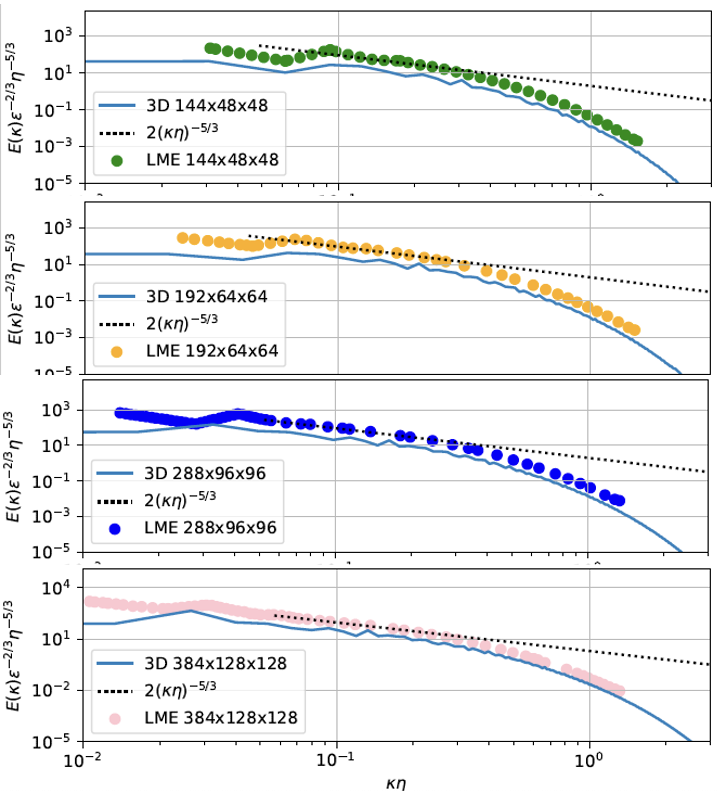
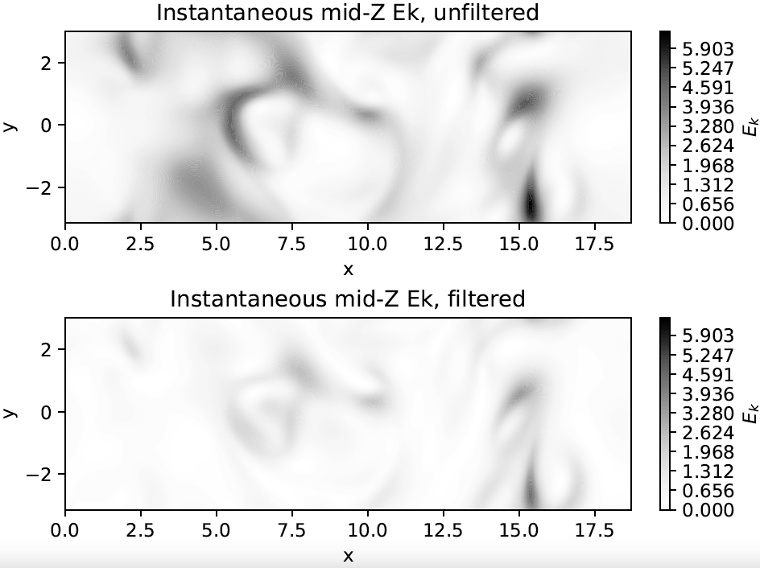

## **DNS_kolmogorov_flow**
This is a repository to generate DNS Kolmogorov flow using **[Dedalus](https://dedalus-project.readthedocs.io/en/latest/#)** based on Dedalus example of 2-D **[Periodic_Shear_flow](https://dedalus-project.readthedocs.io/en/latest/pages/examples/ivp_2d_shear_flow.html)**

## **Introduction**
The following animation is an example of Direct Numerical Simulation (DNS) of a Kolmogorov flow with 384x128x128 grid points. The unit Reynolds number in the code is defined as Re=1/nu with forcing of f=sin(y) on the x-axis. The 3-D simulation script generates the vectors of velocity fluctuation (u',v',w') and the tensors of stress-strain fluctuation (9 components) to calculate the dissipation rate. For the simulation below, Re=90 and after 170 timesteps, we'll get Dissipation rate = 0.37, Taylor-Microscale Reynolds number Re_lambda=113, and resolution=1.1 x Kolmogorov length-scale. Green structures are Q-criterion iso-surfaces visualized in Paraview, Q=10. Slices are vorticity magnitudes.

## **Content of repository**

Dedalus scripts solving the two dimensional (2-D) and 3-D Navier stokes equations as per name below. The commands to run are included in the header of the files.

1. 2Dshear_flow_forcing_LM_new.py
2. 3Dshear_flow_forcing_LM_new.py

The scipts will generate HDF5 files of *.snapshots files and *.checkpoints (for restarting/continuing). The lines that start with "# Analysis" are where I define the output variables.

The post-processing scripts are also included below, which will read ./snapshots.h5 files

3. 2Dplot_snapshots.py 
4. plot_outputs_oop_1_checkh5.py :

The script #3 is only for 2-D simulation as per the Dedalus Periodic shear flow example. It will generate snapshot frames in PNGs showing 2-D pressure and vorticity fields.
The script #4 is for 3-D simulation, calling output variables in ./snapshots.h5 files. It will first check the integrity of *.h5 file, then spit out the average of Dissipation rate, kolmogorov length scale, and Re_lambda. Finally, it will generate graphs for the evolution of dissipation rate (epsilon), Kolmogorov length scale (eta), and non-dimensionalised turbulence power spectra. For Re=30, 50, 70, 90, 110, the comparison plots from **[Lalescu et. al.](https://doi.org/10.1103/PhysRevLett.110.084102)** are included. The cut-off limit 'kc' parameter filters out certain wavenumbers and plots the mid-spanwise Kinetic Energy before and after filtering. 

Additional script #5 below is to convert ./snapshots.h5 files to VTR and generate pretty pictures in Paraview (installed separately). Paraview programmable filter script in #6 is for generating lambda2  visualization. 

5. hdf2vtk.py
6. paraview_programablefilter_lambda2.txt

Examples of plots included in #4 script are the power spectra, and filtered (high-pass) and non-filtered kinetic energy below.

## **Usage**

Please generate a conda environment and follow the instructions of the Dedalus package in **[Dedalus_installation](https://dedalus-project.readthedocs.io/en/latest/pages/installation.html)**
Example of my conda environment is included in "requirements_conda_env.txt", while the pip (might not be needed) is "requirements.txt"

## **Data**
we've run several simulations for Re=30, 50, and 90. The datasets are stored in the following repository:
**[Re=30](https://doi.org/10.7488/ds/7960)** **[or in Zenodo](https://doi.org/10.5281/zenodo.15575430)**,
**[Re=50](https://doi.org/10.7488/ds/7961)** **[or in Zenodo]((https://doi.org/10.5281/zenodo.15577806))**,
**[Re=90](https://doi.org/10.7488/ds/7963)**

## **Contributing**

If you'd like to contribute to Project Title, here are some guidelines:

1. Fork the repository.
2. Create a new branch for your changes.
3. Make your changes.
4. Write tests to cover your changes.
5. Run the tests to ensure they pass.
6. Commit your changes.
7. Push your changes to your forked repository.
8. Submit a pull request.

The publication will be informed later.

## **License**

This project is currently released under no License. You can responsibly use and modify it as you wish.  

## **Authors and Acknowledgment**

Project Title was created by **[Andhini](https://github.com/andhini)**.

## **Contact**

If you have any questions or comments about this project and want to collaborate further, please contact **[Andhini Zurman-Nasution](andhininznasution@gmail.com)**.

